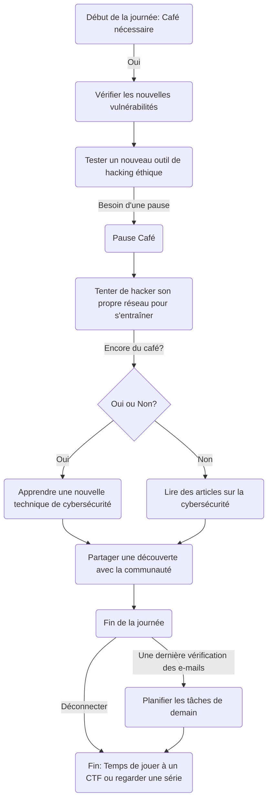

### Hi there 👋

<!--
**AC2002FR/AC2002FR** is a ✨ _special_ ✨ repository because its `README.md` (this file) appears on your GitHub profile.
-->

### My funny daily routine : 

### Connect with me : 

