### Hi there 👋

<!--
**AC2002FR/AC2002FR** is a ✨ _special_ ✨ repository because its `README.md` (this file) appears on your GitHub profile.
-->

### My funny daily routine : 

```mermaid
graph TD;
A("Début de la journée: Café nécessaire") -->|Oui| B("Vérifier les nouvelles vulnérabilités");
B --> C("Tester un nouveau outil de hacking éthique");
C -->|Besoin d'une pause| D("Pause Café");
D --> E("Tenter de hacker son propre réseau pour s'entraîner");
E -->|Encore du café?| F{"Oui ou Non?"};
F -->|Oui| G("Apprendre une nouvelle technique de cybersécurité");
F -->|Non| H("Lire des articles sur la cybersécurité");
G --> I("Partager une découverte avec la communauté");
H --> I;
I --> J("Fin de la journée");
J -->|Une dernière vérification des e-mails| K("Planifier les tâches de demain");
J -->|Déconnecter| L("Fin: Temps de jouer à un CTF ou regarder une série");
K --> L;
```

### Connect with me : 

